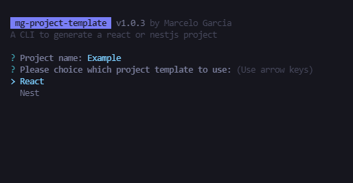

# Proyect Template CLI Tool

A cli tool for creating a template project

## Quick Overview

```sh
npx mg-create-project
cd your-project-name
npm start or npm run start:dev for nest project
```

## Creating a new project

**You’ll need to have Node 12 or later version on your local development machine**.

To create a new project, you need enter the following command:

### npx

```sh
npx mg-create-project
```

After entering the command above, the follwing options will pop up.

<p align='center'>

</p>

## Packages Used

[cli-welcome](https://github.com/ahmadawais/cli-welcome) |
[esm](https://github.com/standard-things/esm) |
[inquirer](https://github.com/SBoudrias/Inquirer.js) |
[nanospinner](https://github.com/usmanyunusov/nanospinner) |
[shelljs](https://github.com/shelljs/shelljs)

```sh
npm i cli-welcome esm inquirer nanospinner shelljs
```
